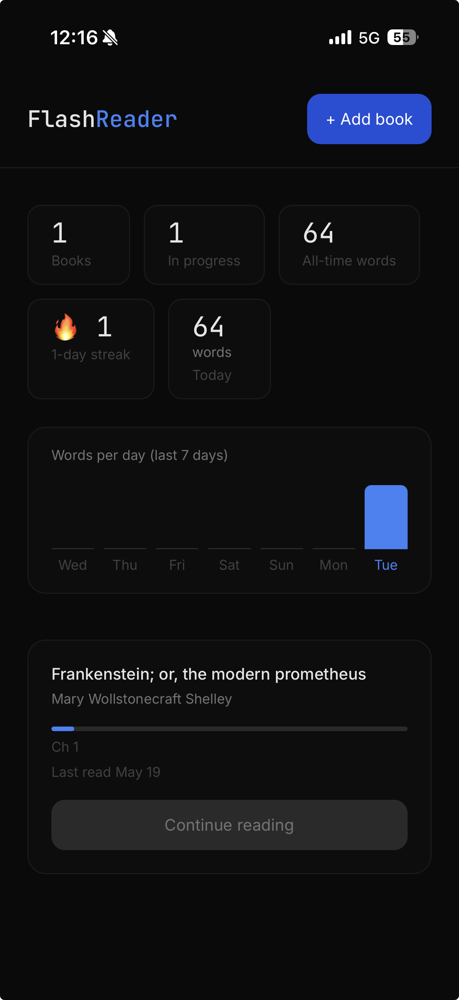
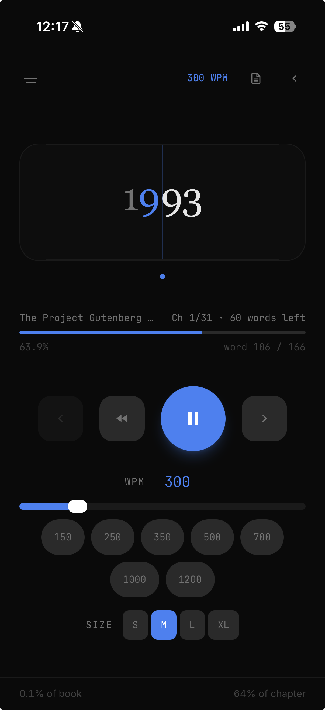

# FlashReader

Speed reader with AI comprehension. Upload a DRM-free `.epub`, read at up to 1200 WPM using RSVP, and verify retention with AI-generated recaps and quizzes.

<p align="center">
  
  &nbsp;&nbsp;
  
</p>

## How it works

RSVP (Rapid Serial Visual Presentation) shows one word at a time, centered on the **optimal recognition point**: the character your eye naturally anchors to. Your eyes stop moving, reading speed goes up. Punctuation gets longer delays so your brain can process sentence boundaries.

When a chapter ends you choose: skip or get an AI recap + 3-question quiz. Recaps are cached so they only hit the API once per chapter.

## Features

- **RSVP engine**: 100–1200 WPM, ORP pivot highlighted in blue, punctuation-aware delays
- **Library**: books persist in SQLite, upload once and they're always there
- **Progress**: chapter and word position saved automatically, restored on reopen
- **AI reflection**: 3-sentence chapter recap + multiple-choice quiz (OpenAI `gpt-4o-mini`)
- **Recap cache**: AI output saved to SQLite, never regenerated unless you retry
- **Notes**: add a note at any chapter + word position, stored per book
- **Reading stats**: daily word count, streak, 7-day bar chart
- **Text size**: S / M / L / XL word display
- **Keyboard shortcuts**: `Space` play/pause, `←` skip back 10 words, `↑↓` speed, `→` next chapter
- **Docker Compose**: single command deploy

## Stack

| Layer | Tech |
|---|---|
| Frontend | React 18, TypeScript, Vite, Tailwind CSS, Framer Motion |
| Backend | Node.js, Express |
| Database | SQLite via `better-sqlite3` |
| ePub parsing | JSZip (browser-side) |
| AI | OpenAI `gpt-4o-mini` |
| Deploy | Docker Compose + nginx |

## Quick start

### Docker (recommended)

```bash
git clone https://github.com/yourname/flashreader
cd flashreader

echo "OPENAI_API_KEY=sk-..." > backend/.env

docker compose up --build
```

Open `http://localhost:8080`.

### Local dev

**Backend**
```bash
cd backend
cp .env.example .env      # add your OPENAI_API_KEY
npm install
node server.js
```

**Frontend**
```bash
cd frontend
npm install
npm run dev
```

Open `http://localhost:5173`.

## Environment variables

`backend/.env`:

```env
OPENAI_API_KEY=sk-...
PORT=3001              # optional, default 3001
DB_PATH=/app/data/flashreader.db  # optional, set automatically by Docker
```

## Data storage

All data lives in SQLite (`backend/flashreader.db` locally, Docker volume in production). Nothing is sent externally except chapter text to OpenAI when you explicitly request a recap.

| Data | Table |
|---|---|
| Books (parsed chapters) | `books` |
| Reading position | `progress` |
| AI recaps + quizzes | `recaps` |
| Notes | `notes` |
| Daily word counts | `daily_stats` |

## Notes on epub parsing

Only DRM-free `.epub` files are supported. The file is parsed entirely in the browser (JSZip): the raw file is never sent to the server. Only the parsed text content is uploaded to save to the database.

Boilerplate chapters (Contents, Foreword, Acknowledgements, Copyright, etc.) are skipped automatically and don't trigger the AI reflection prompt.

## License

MIT
